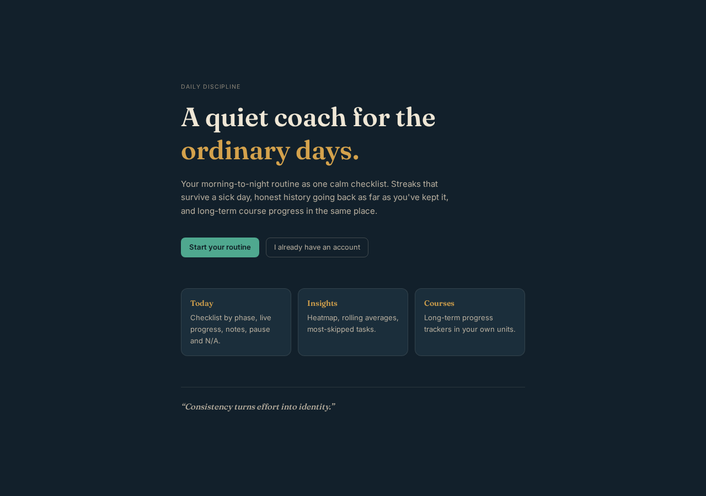
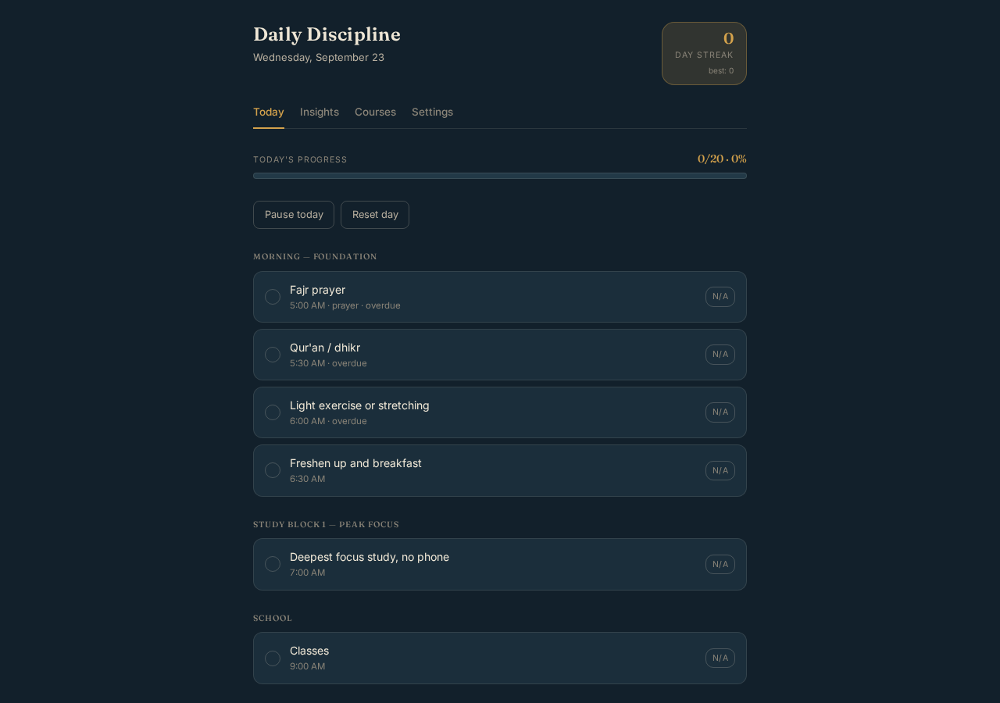
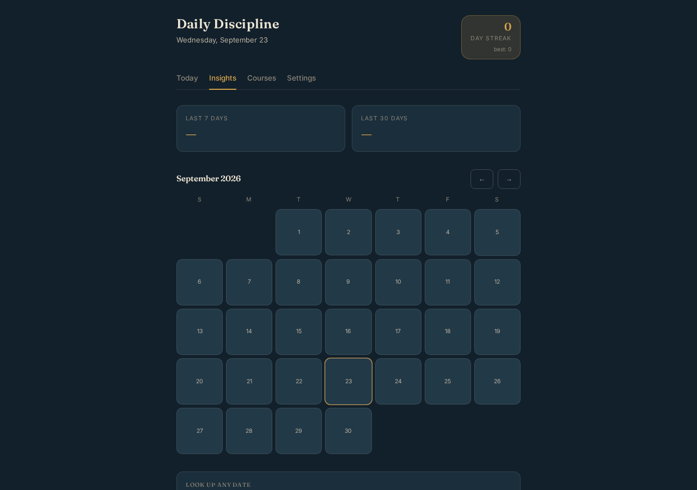
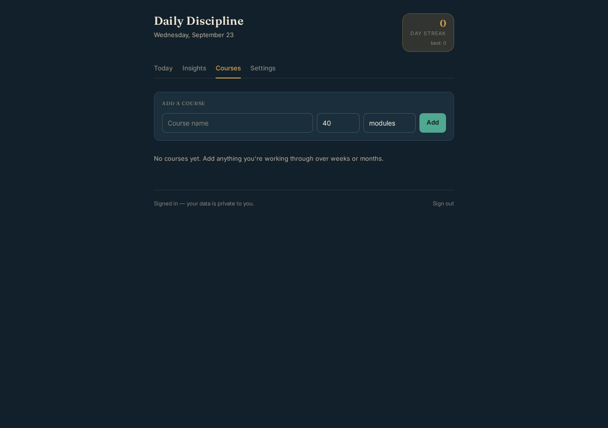
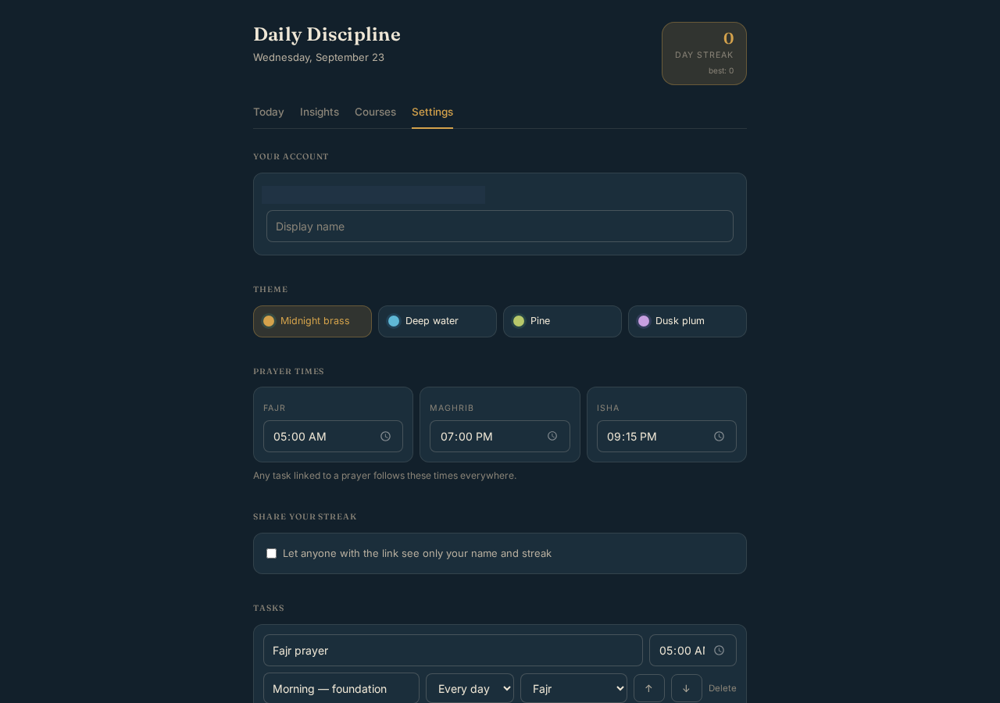
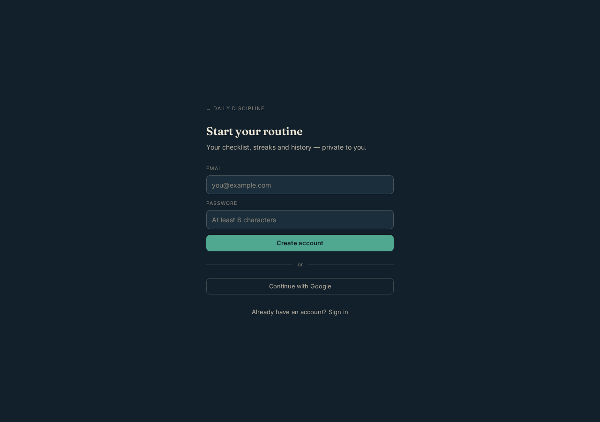

<div align="center">

# 🌙 Daily Discipline

**A quiet coach for the ordinary days.**

Your morning-to-night routine as one calm checklist — streaks that survive a sick day, honest history going back as far as you've kept it, and long-term course progress in the same place.


</div>

---

## ✨ Feature Tour

### 🏠 Landing — a calm first impression

A warm, editorial welcome with the day's quote and a clear path to start.



---

### ✅ Today — your daily checklist

The heart of the app. Your whole day, grouped by phase, sorted by time.



| Feature | What it does |
| --- | --- |
| ☑️ **One-tap check-off** | Tap the circle to mark a task done — saves instantly, survives reloads |
| 🚫 **N/A per task** | Mark a task "not applicable" today without hurting your completion rate |
| ⏸️ **Pause today** | Sick day? Travel? Pause the whole day — your streak stays intact |
| 📊 **Live progress bar** | `done / total · %` updates with every tap |
| ⏰ **Overdue hints** | Tasks past their scheduled time are gently flagged |
| 🕌 **Prayer-linked times** | Tasks tied to Fajr / Maghrib / Isha follow your prayer clock automatically |
| 📝 **Daily notes** | A private journal line for each day |
| 🏅 **Milestone badges** | Earned at streak milestones (3, 7, 14, 30, 60, 100… days) |
| 🔄 **Reset day** | Clear today and start fresh |

---

### 📈 Insights — honest long-term history

A monthly completion calendar, rolling averages, and the truth about what you skip.



| Feature | What it does |
| --- | --- |
| 🗓️ **Month calendar** | Every day color-coded by completion; click any day for full detail |
| 📉 **7-day & 30-day averages** | Rolling completion rates so one bad day never lies to you |
| 🔍 **Look up any date** | Jump to any day in your history and see exactly what you did |
| ⏭️ **Most-skipped tasks** | See which tasks you avoid, so you can fix the routine |
| 🧭 **Month navigation** | Browse backward through your entire history |

---

### 🎓 Courses — long-term progress trackers

For goals measured in weeks or months, not days.



- ➕ Add anything — a book (pages), a course (modules), a savings goal (units of your choice)
- ➕/➖ Increment or correct progress with one tap
- 📊 Progress bar per course, persisted across devices
- 🗑️ Remove finished or abandoned courses

---

### ⚙️ Settings — make it yours



| Section | What you control |
| --- | --- |
| 👤 **Account** | Display name shown across the app and on shared streaks |
| 🎨 **Themes** | Four hand-tuned dark themes: **Midnight brass · Deep water · Pine · Dusk plum** |
| 🕌 **Prayer times** | Set Fajr, Maghrib and Isha once — every linked task follows |
| 🔗 **Share your streak** | Optional public link showing only your name and streak — nothing else |
| ✏️ **Task editor** | Rename, retime, reorder (↑↓), reschedule (weekdays/every day), re-link prayers, delete |
| ➕ **Add tasks** | Extend the routine with your own phases, times and rules |

---

### 🔐 Auth — private by default



- 📧 Email + password sign-up and sign-in (with email confirmation)
- 🟢 One-tap **Continue with Google**
- 🔒 Every row of your data is protected by row-level security — only you can ever read or write it

---

## 🧠 How streaks work

```text
Complete every applicable task today
        │
        ▼
  streak + 1 ──────────────►  new milestone? → 🏅 badge
        │
  paused day / N/A tasks  ──►  don't break the streak
        │
  missed day (not paused) ──►  streak resets, best streak preserved
```

## 🏗️ Architecture

```text
┌────────────────────────────────────────────────────┐
│  React 19 + TanStack Start (SSR, file-based routes)│
│                                                    │
│  /            landing        (public)              │
│  /auth        sign in / up   (public)              │
│  /s/:slug     shared streak  (public, read-only)   │
│  /today  /insights  /courses  /settings            │
│            └── behind the authenticated gate       │
└──────────────┬─────────────────────────────────────┘
               │  browser client (publishable key + session)
               ▼
┌────────────────────────────────────────────────────┐
│  Lovable Cloud (Postgres + Auth + RLS)             │
│                                                    │
│  tasks          your routine definition            │
│  daily_logs     one row per day (checks, N/A, …)   │
│  courses        long-term trackers                 │
│  user_settings  theme, prayer times, streaks, …    │
│                                                    │
│  🔒 Row-level security on every table:             │
│     auth.uid() = user_id — you see only your data  │
└────────────────────────────────────────────────────┘
```

## 🗂️ Project structure

```text
src/
├─ routes/
│  ├─ index.tsx                landing page
│  ├─ auth.tsx                 email + Google sign-in
│  ├─ s.$slug.tsx              public shared-streak page
│  └─ _authenticated/          gated app (Today · Insights · Courses · Settings)
├─ lib/
│  ├─ discipline.ts            types, default routine, streak & progress logic
│  ├─ api.ts                   database reads/writes
│  └─ store.tsx                app-wide state provider
├─ components/AppShell.tsx     header, streak chip, tab navigation
└─ styles.css                  design tokens + 4 themes
```

## 🎨 Themes

| Theme | Mood |
| --- | --- |
| 🟡 Midnight brass | Warm ink and gold (default) |
| 🔵 Deep water | Cool slate and teal |
| 🟢 Pine | Forest green calm |
| 🟣 Dusk plum | Soft violet evening |

## 🔒 Privacy

- No analytics, no trackers, no third-party data sharing
- Your routine, logs and notes are visible only to you
- The shared-streak link exposes **only** your display name and streak numbers — and only when you turn it on

---

<div align="center">
Built with ❤️ on <strong>Lovable</strong>
</div>
